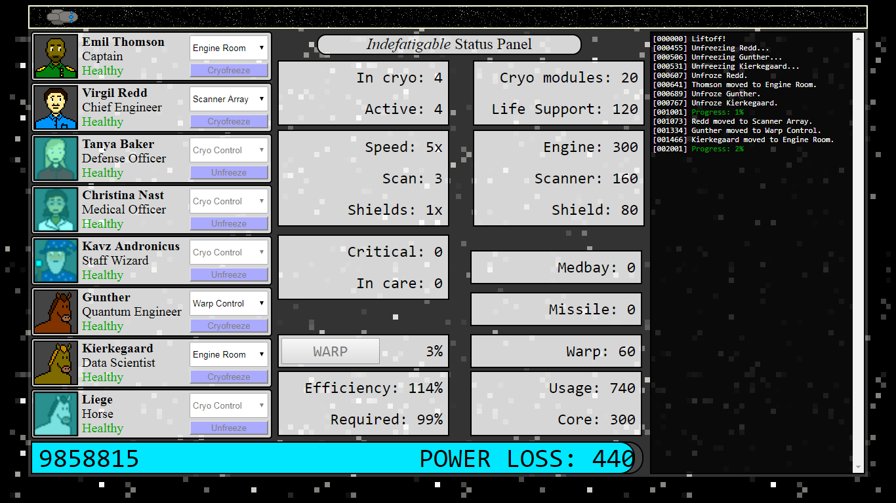
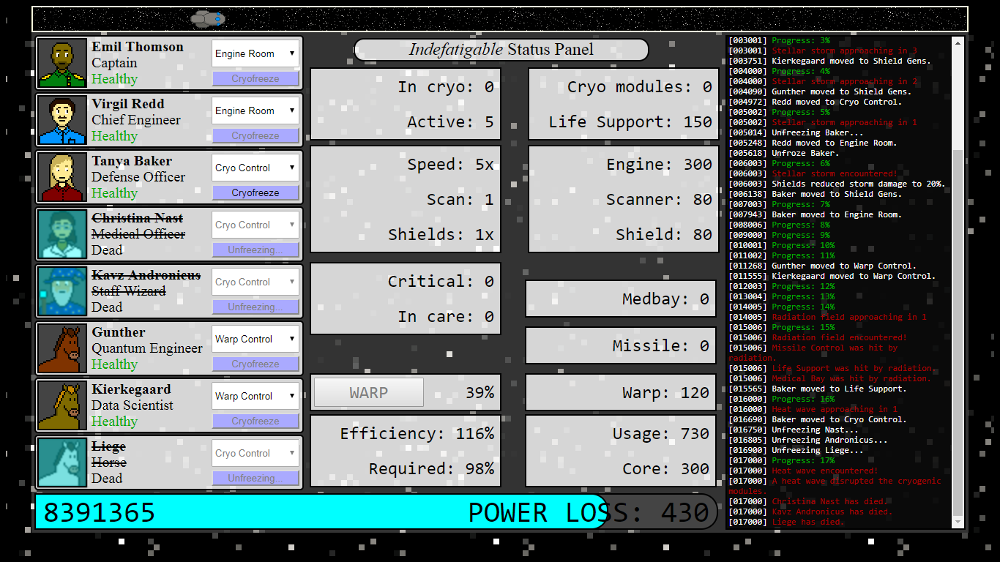
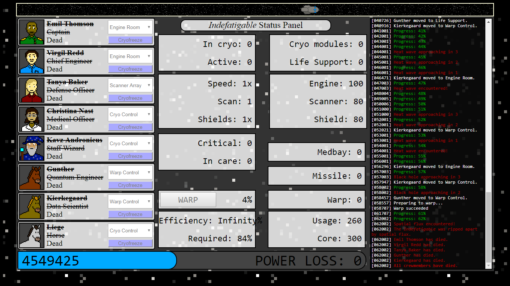

# Voyage of the Indefatigable

**Voyage of the _Indefatigable_** is a resource management game taking place on the starship _Indefatigable_. The eight crew members are on a journey through space, but their ship's core can only produce enough power to run the cryostasis modules. In order to reach their destination, they must make use of their stored reserves of power to run the life support and other ship systems in order to defend against threats like stellar storms and radiation fields.

There's no music, but consider [playing this in the background](https://www.youtube.com/watch?v=0mHf0cKPU5g).

## Ship positions
* **Cryo Control:** Any crew member can place themselves in cryostasis, but an active crew member must man Cryo Control to thaw frozen crew members. Crew members in cryostasis take less power to keep alive.
* **Engine Room:** Man the Engine Room to increase the _Indefatigable_'s speed. Each additional crew member makes the ship faster and more efficient in its power usage.
* **Life Support:** Man Life Support to decrease the power usage per active crew member.
* **Medical Bay:** Man the Medical Bay with a healthy crew member to heal an injured crew member in the Medical bay. Injured crew members will worsen and eventually die outside the Medical Bay.
* **Missile Control:** Man Missile Control to destroy hostile fighters attacking the ship.
* **Scanner Array:** Man the Scanner Array to increase the range at which oncoming crises are detected.
* **Shield Gens:** Man the Shield Gens to decrease the damage taken from stellar storms.
* **Warp Control:** Man Warp Control to build warp charge. When the warp charge is full, the _Indefatigable_ can jump forward to skip past crises.

## Crises

* **Stellar storm:** A storm hits the _Indefatigable_, costing power to maintain the shields. Each crew member manning Shield Gens reduces the power loss.
* **Radiation field:** Radiation hits up to three ship positions, injuring any crew members there. Each crew member manning Life Support reduces the number of positions hit.
* **Hostile fighters:** Hostile fighters attack the _Indefatigable_, costing energy to fend off. Any hostiles that aren't destroyed will return and attack again. Each crew member manning Missile Control destroys hostile fighters when they attack.
* **Heat wave:** A heat wave disrupts the cryostasis modules, killing any crew members in cryostasis.
* **Spatial flux:** Spacetime anomalies require warp charge to weather. The _Indefatigable_ is destroyed unless Warp Control is manned with at least 15% warp charge. All members crewing Warp Control are injured.
* **Black hole:** The gravitational pull of the black hole captures and consumes all that come too close. The _Indefatigable_ is destroyed and everybody dies. Better warp past this one...

## Screenshots

